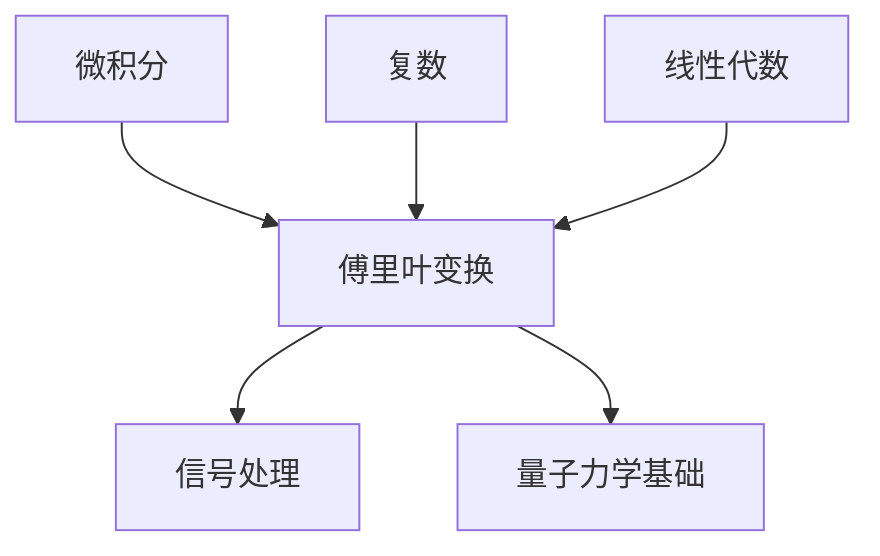

# 扩展可视化工具箱 · 第二批次（extended-viz-2）

> v1.2.0 新增。第一批次（extended-viz.md）覆盖图表/网络/电路/动画/几何类；本批次覆盖**结构图零成本化、物理真实模拟、配音讲解、学习闭环、3D 单文件交付**五类。**除标注外全部经真机实测（2026-10-06，Windows / Python 3.13 venv / Chrome headless）**，实测坑已写进各节「坑表」。

## 选型速查表

| 教学场景 | 首选 | 备选 | 实测状态 |
|---|---|---|---|
| 体系 DAG / 流程 / 状态机 | **Mermaid**（Markdown 原生渲染） | graphviz（第一批） | 语法标准，宿主渲染 |
| 物理原理真实模拟 | **pymunk**（Python 2D 刚体） | matter.js（网页交互） | ✅ 实测通过 |
| 中文语音讲解 | **edge-tts**（独立 mp3） | manim-voiceover（与动画同步） | ✅ 实测通过 |
| 自测 / 记忆闭环 | **交互自测 HTML** + **genanki**（Anki） | — | ✅ 实测通过（判分 5/5） |
| 3D 模型网页展示 | **trimesh 造 glb → model-viewer** | three.js GLTFLoader（第一批 3D 层） | ✅ 实测通过（截图验证） |

选型原则：能**内嵌进学习卡同目录**就内嵌（单文件 HTML / data URI）；需要引擎计算才上 pymunk；宿主平台能渲染就不自己出图（Mermaid）。

---

## 1. Mermaid —— 文本即图（体系 DAG 零成本化）

**是什么**：用文本语法定义流程图/时序图/状态机，GitHub、GitLab、WorkBuddy 对话、Obsidian 均**原生渲染**，零脚本零产物文件。

**为什么**：Phase 2 的「体系坐标依赖图」此前用 matplotlib 画（几十行代码出一张静态图）。Mermaid 三行文本搞定，且能被平台渲染成矢量图，还能随源文件版本管理。

**怎么用**（在学习卡 md 中直接写）：

````markdown

````

渲染效果：自上而下的依赖图，节点带中文标签。

常用图型速查：`graph TD/LR`（依赖/流程）、`sequenceDiagram`（协议时序）、`stateDiagram-v2`（状态机）、`classDiagram`（类关系）、`pie`（占比）。

**边界**：宿主不支持时（纯文本阅读场景）退化为代码块——依赖关系仍可读；需要精确排版控制或超大图（>50 节点）时改用 graphviz（第一批）。

---

## 2. pymunk —— 2D 物理真实模拟

**是什么**：Chipmunk 物理引擎的 Python 绑定。刚体、关节、碰撞、重力全部真实数值计算，不是手绘帧。

**为什么**：讲「单摆周期」「碰撞守恒」「波的传播」时，手绘动画是编的，pymunk 是**真算的**——还能顺手展示近似公式的失效边界（这正是技能的核心卖点：边界与反例）。

**实测模板**（单摆：小振幅 vs 大振幅，验证 T=2π√(L/g) 只在小角度成立）：

```python
import os
os.chdir(os.path.dirname(os.path.abspath(__file__)))  # 产物落盘到脚本目录
import math, pymunk
import matplotlib
matplotlib.use("Agg")
import matplotlib.pyplot as plt
from matplotlib.animation import PillowWriter

plt.rcParams["font.family"] = ["Microsoft YaHei", "SimHei"]
plt.rcParams["axes.unicode_minus"] = False

L, G, DT, SIM_T = 1.0, 9.8, 0.001, 6.0

def simulate(theta0_deg):
    space = pymunk.Space(); space.gravity = (0.0, -G)
    body = pymunk.Body(1.0, 1.0 * L * L / 3)
    body.position = (L*math.sin(math.radians(theta0_deg)), -L*math.cos(math.radians(theta0_deg)))
    joint = pymunk.PinJoint(space.static_body, body, (0, 0), (0, 0))
    space.add(body, joint)   # 必须 body+joint 都 add；只 add joint 时 body 不被模拟（静默！）
    ts, ths = [], []
    for i in range(int(SIM_T/DT)):
        space.step(DT)
        if i % 10 == 0:  # 100Hz 采样
            ts.append(i*DT); ths.append(math.atan2(body.position[0], -body.position[1]))
    return ts, ths

def measure_period(ts, ths):  # 过零上升沿测周期
    zeros = [ts[i] for i in range(1, len(ts)) if ths[i-1] < 0 <= ths[i]]
    if len(zeros) < 2:      # 防守卫：模拟未发生时宁可报错，不静默返回 -0.0
        raise RuntimeError(f"过零点不足({len(zeros)})：检查 body 是否 add 进 space、仿真时长是否够")
    return sum(b-a for a, b in zip(zeros, zeros[1:])) / (len(zeros)-1)

t5, th5 = simulate(5); t60, th60 = simulate(60)
print(f"θ0=5°  T={measure_period(t5, th5):.4f}s")   # 2.0100s（+0.14%）
print(f"θ0=60° T={measure_period(t60, th60):.4f}s") # 2.1550s（+7.37%）
# 理论修正 1+θ²/16 = 1.0685（+6.85%）→ 引擎数据与摄动理论吻合
```

动画出 GIF：对 `ths` 逐帧画摆杆+摆锤（`ax.plot` 摆线、圆点摆锤），用 `PillowWriter` 保存（见坑表）。

**实测结果**（2026-10-06）：θ₀=5° 周期 2.0100s（+0.14%），θ₀=60° 周期 2.1550s（+7.37%），理论修正系数 1+θ²/16=1.0685——引擎实算与摄动理论吻合，GIF 371KB。

**坑表（实测）**：
1. `PillowWriter` **不支持 with 上下文**（`TypeError: does not support the context manager protocol`）→ 用 `writer = PillowWriter(fps=25)` + `with writer.saving(fig, "x.gif", dpi=90):` 循环 `grab_frame()`。
0. **pymunk 只 add joint 不 add body = 模拟静默不发生**（无任何报错，θ 恒为初值，measure_period 无守卫时返回 `0/-1 = -0.0`，肉眼极难察觉）→ 必须 `space.add(body, joint)`；测周期函数加 `len(zeros)<2 抛错` 守卫。2026-10-06 对抗性审查实测抓到。
2. Unicode 下标 `₀`(U+2080) 在微软雅黑**缺字形**（Glyph missing 警告，渲染成方框）→ 用 mathtext `$\theta_0$`，别用 Unicode 下标字符。
3. 转动惯量随便给会数值发散/摆速异常；质点摆给 `m*L²/3` 量级稳定。

**依赖**：`pip install pymunk`（纯计算无外联）。

---

## 3. edge-tts / manim-voiceover —— 中文语音讲解

**是什么**：edge-tts 是微软 Edge 朗读接口的 Python 客户端（免费、无需 API Key）；manim-voiceover 是 Manim 官方配音扩展（解说词与动画帧精确同步）。

**为什么**：「能听懂」是通俗版的延伸——音频讲解适合转发给家人朋友、通勤场景；manim-voiceover 解决「动画 3 秒播完、解说 8 秒念不完」的对不齐问题。

**实测模板**（edge-tts，40 秒中文讲解音频一次成功）：

```python
import asyncio, edge_tts

async def main():
    tts = edge_tts.Communicate(
        "电流是什么？打个比方，电流就像水管里的水流……",
        voice="zh-CN-XiaoxiaoNeural",  # 女声；zh-CN-YunxiNeural 男声
        rate="+5%")
    await tts.save("explain.mp3")

asyncio.run(main())
```

**实测结果**：203KB mp3（约 40s），中文自然度良好。语音端点 speech.platform.bing.com 在受限网络下可达。

**manim-voiceover**（⚠️ 实测受限，2026-10-06 取证：包本体官方 PyPI 可装（清华镜像无源），但 gtts 后端需 `pip install "manim-voiceover[gtts]"`，且**缺包时渲染进程会交互式询问安装导致 headless 挂死**；gtts 合成依赖 translate.google.com——受限网络下不可用（`--dry_run` 也过不了，真实报错 `gTTS gave an error`）。受限环境绕行：**edge-tts 出独立 mp3 + Manim 正常渲染**（本节上方路径），或将 mp4 与 mp3 交给前端 `<audio>` 同步。

```python
from manim import *
from manim_voiceover import VoiceoverScene
from manim_voiceover.services.gtts import GTTSService  # 联网可用环境才装得动

class MyScene(VoiceoverScene):
    def construct(self):
        self.set_speech_service(GTTSService())
        with self.voiceover(text="这句话念完之前，动画不会走完") as tracker:
            self.play(Create(Circle()), run_time=tracker.duration)
```

**边界**：edge-tts 依赖微软在线接口（离线不可用）；交付时 mp3 与学习卡同目录、主卡里相对路径引用。离线场景降级为纯文字通俗版（v1.1.3 双文档已覆盖）。

### 3.1 配音与动画合体（v1.5.1 新增，真机实测）

manim-voiceover 在受限网络下走不通（上方取证），但**「动画 3 秒播完、解说 8 秒念不完」这个原始痛点不必放弃**：edge-tts 出音频 + ffmpeg 合成，全程不依赖 SoX、不依赖 Google 服务。实测产出 50 KB 单文件 mp4，同时含 h264 视频流与 aac 音频流。

```bash
# 1) 语音 + 字幕一次出（--write-subtitles 直接得到 srt，UTF-8 无 BOM，实测时间轴正确）
edge-tts --voice zh-CN-XiaoxiaoNeural \
         --text "熵是无序度的度量，这就是它的本质。" \
         --write-media explain.mp3 --write-subtitles explain.srt

# 2) 与动画合体（-c:v copy 不重编码，秒级完成）
ffmpeg -y -i scene.mp4 -i explain.mp3 -c:v copy -c:a aac -shortest out.mp4

# 3) 字幕作为软字幕轨（看片端可开关；要烧进画面则去掉 -c:v copy 改滤镜）
ffmpeg -y -i out.mp4 -i explain.srt -c:v copy -c:a copy -c:s mov_text out_sub.mp4

# 4) 自检：必须同时看到 video 与 audio 两条流
ffprobe -v error -show_entries stream=codec_type,codec_name -of csv=p=0 out.mp4
```

分镜已按 ~4 字/秒 估过时长（见 manim-patterns.md §一）：逐镜 TTS 后按镜拼接即可让画面与解说对齐；不做逐镜对齐时，`-shortest` 能保证不出现「音频播完画面还在动」的尾巴。

> 与 SoX 的关系：manim 自带音频合成依赖 SoX（本机缺装，渲染时警告 `SoX could not be found`），本条管线完全绕开它。

---

## 4. 交互自测 HTML + genanki —— 学习闭环

**是什么**：把 Phase 5 骨架里的「自检问题」升级成两个产物——①单文件答题组件（浏览器打开即测、即时判分带解析）；②genanki 导出 .apkg（导入 Anki 按遗忘曲线复习）。

**为什么**：自检问题躺在 md 里只是「看过」，变成可交互判分/记忆卡才是「测过」——学习闭环从「读」推进到「测+复习」。

**交互自测模板要点**（完整可运行模板：本仓库 [`references/templates/quiz-template.html`](templates/quiz-template.html)，经 Chrome headless 实测判分 5/5）：
- 单文件、零依赖：`QUIZ` 数组内嵌题目（题干/选项/答案索引/解析），`grade()` 判分并对正确项加 `.right`、错选项加 `.wrong` 样式，解析随判分展开；
- **判分后不弹 alert**，结果写进 `#result` div（含「通过/回看建议」文案）；
- 附带 `#selftest` 自动答题模式：把判分结果写进 DOM（`SELFTEST score=5/5 pass=true`），供 `chrome --headless=new --dump-dom` 机器断言——**交付前真机自检的固定手段**。

**genanki 模板**（实测 5 卡 → 53KB apkg）：

```python
import genanki

model = genanki.Model(
    1607392319, "通识自检卡",
    fields=[{"name": "Question"}, {"name": "Answer"}],
    templates=[{"name": "Card 1", "qfmt": "{{Question}}",
                "afmt": '{{FrontSide}}<hr id="answer">{{Answer}}'}])
deck = genanki.Deck(2059400110, "通识学习::电流")  # ID 固定可增量更新
CARDS = [("电流的本质是什么？", "电荷的定向移动，I = dQ/dt。")]  # ← 占位示例：换成本主题自检问题 (问题, 要点) 列表
for q, a in CARDS:
    deck.add_note(genanki.Note(model=model, fields=[q, a]))
genanki.Package(deck).write_to_file("electric-current.apkg")
```

**坑表**：Deck/Model 的 ID 一经发布**必须固定**（随机 ID 会导致 Anki 里重复建组）；ID 生成取 `random.randrange(1<<30, 1<<31)` 一次并写死在模板常量里。题目/选项文本中的 `<` `&` 由模板 `esc()` 统一转义（2026-10-06 对抗实测：`` 注入不执行、`a<b` 不破版式、判分不回归）；**QUIZ 源码内联数据避免出现字面 `</script>`**——它会在 HTML 解析层截断脚本块，任何运行时转义都救不了，必要时写 `<\/script>`。

---

## 5. trimesh 造 glb + model-viewer —— 3D 单文件交付

**是什么**：trimesh（纯 Python 几何库）代码生成 3D 网格导出 glb；model-viewer（Google Web Component）一个标签在网页里展示，支持拖转/缩放/自转/阴影。

**为什么**：第一批 3D 五层选型产出的是 mp4/GIF（观众只能看）；model-viewer 产出**可交互 3D**（观众能转着看），且 glb 内嵌 base64 后**单 HTML 双击即用**——这是 Blender bpy 之外的轻量 3D 交付通道。

**实测链路**（trimesh 造环面 → glb → 内嵌 HTML → Chrome headless 截图验证渲染）：

```python
import trimesh
mesh = trimesh.creation.torus(major_radius=1.0, minor_radius=0.3)
mesh.visual.face_colors = [66, 133, 244, 255]
trimesh.Scene(mesh).export("model.glb")
```

```html
<script type="module"
  src="https://cdn.jsdelivr.net/npm/@google/model-viewer@4.1.0/dist/model-viewer.min.js"></script>
<model-viewer src="model.glb" auto-rotate camera-controls shadow-intensity="1"></model-viewer>
```

**单文件化（关键，实测截图通过）**：glb 转 base64 内嵌，绕开 file:// 限制：

```python
import base64
b64 = base64.b64encode(open("model.glb", "rb").read()).decode()
html = f'<model-viewer src="data:model/gltf-binary;base64,{b64}" auto-rotate></model-viewer>'
```

**实测结果**：环面 3D 渲染完整（阴影+渐变背景+自转），HTML 57KB 单文件。

**坑表（实测）**：
1. trimesh 5.x **没有 `creation.torus_knot`**（4.x 有）→ 用 `creation.torus(major_radius, minor_radius)`；可用创建器以 `dir(trimesh.creation)` 为准。
2. glb 导出时设置过 face_colors 会走 face→vertex 颜色转换，**需要 scipy**（可选依赖）→ `pip install scipy`，或干脆不设色（默认 PBR 材质）。
3. **`<model-viewer src="./x.glb">` 直接双击 HTML（file://）会被 CORS 拦**，模型区空白 → 必须 glb 内嵌 data URI（单文件交付）或起 http 服务（`python -m http.server`）。
4. headless 截图 WebGL 需 `--enable-unsafe-swiftshader`；**Chrome 对工作区目录写截图文件可能被拒**（0x5 拒绝访问）→ `--screenshot` 指到 `%TEMP%`。

**边界**：model-viewer 依赖 CDN 加载 JS（受限网络下确认 jsdelivr 可达）；纯离线场景降级为第一批的 mp4/GIF 路线。

> **更高质量的 glb 来源（v1.5.4）**：本节用 trimesh 造模型，几何简陋、无材质；本机装了 Blender 时应改由 Blender 导出 glb（PBR 材质完整），路线与实测数据见 3d-animation.md §3-E.2，模板 references/templates/model-viewer-template.html。

**离线自足档（v1.5.1 新增）**：交付物要能脱离网络双击打开时，把库**内联**进 HTML，或落到同目录 `assets/` 相对引用。实测 CDN 体积：`three@0.128 three.min.js` **589 KB**、`@google/model-viewer` 913 KB、`echarts` 1005 KB——内联后单文件在 0.6–1.4 MB 量级，完全可接受；仅在「体积优先且观看方在线」时才用 CDN 版本。

```bash
# 取库到本地（离线自足档第一步）；或把 min.js 内容直接写进 <script>…</script> 得到单文件
curl -L -o assets/three.min.js https://cdn.jsdelivr.net/npm/three@0.128.0/build/three.min.js
```

> 内联注意：库源码若含字面 `</script>` 会截断脚本块（与 quiz 模板同一条坑，任何运行时转义都救不了），必要时写 `<\/script>`。

---

## 6. 交互产物自测（SELFTEST 约定，v1.5.2 新增）

**是什么**：任何交互产物（canvas 滑块组件 / Three.js 场景 / vpython HTML / model-viewer 单文件）统一暴露 `window.__SELFTEST__()` 返回 `{pass, checks, note}`；以 `#selftest` 打开时把结果写进 DOM，形如 `SELFTEST {"pass":true,...}`。两个入口：

- 模板（四件）：`selftest-web-template.html`（滑块/画布：非空 + 交互断言 + WebGL 断言 + a11y）、`drag-interactive-template.html`（**拖对象·自由拖**：单位圆 + 指针/键盘 + 读数与数学一致性断言）、`constraint-drag-template.html`（**拖对象·约束拖**：连杆链 + 边长守恒断言）、`model-viewer-template.html`（glb → 单文件可拖拽 3D）
- 断言器：`python scripts/selftest_web.py <产物.html>`（Chrome headless 真机跑一遍，退出码 0=通过 / 1=失败 / 2=环境问题）

**为什么**：静态图能靠肉眼，交互产物不能——白屏、死控件、CDN 没加载，全都「长得像一个正常页面」。这是 quiz 模板 `#selftest` 模式的推广。

**实测（2026-10-07，Chrome headless=new + `--disable-gpu`）**：headless 下 **WebGL 可渲染且可断言**——`gl.readPixels` 返回 `51,102,204,255`，正是 `clearColor(0.2,0.4,0.8,1)` 的期望值；2D canvas 用「不同颜色数 > 20」判定非空。反面用例（空白画布）被正确判 FAIL、退出码 1——**证明断言不是永真**。

```bash
python scripts/selftest_web.py                        # 自检内置模板
python scripts/selftest_web.py 产物/主题—3D结构.html   # 断言具体产物（默认加 #selftest 锚点）
python scripts/selftest_web.py 产物.html --json       # 机器可读
```

**页面侧最小实现**：

```js
window.__SELFTEST__ = function () {
  const checks = {
    '画布非空': distinctColors() > 20,        // 空白画布 = 1 种颜色
    '交互改变图形': sigBefore !== sigAfter,  // 改参数重绘后指纹必须变
    'WebGL可渲染': webglOk                    // 拿不到 context 时返回 'skip'，不硬判失败
  };
  const failed = Object.keys(checks).filter(function (k) { return checks[k] === false; });
  return { pass: failed.length === 0, checks: checks, failed: failed };
};
if (location.hash === '#selftest') {
  document.getElementById('selftest-out').textContent =
    'SELFTEST ' + JSON.stringify(window.__SELFTEST__());
}
```

**坑表（实测）**：
0. **WebGL 拿不到 context 要判 `skip`，不要判 fail**——`--disable-gpu` 下多数机器走 SwiftShader 正常，但个别环境真的没有；硬判失败会把「环境限制」误报成「产物坏了」。个别 Chrome 版本还需 `--enable-unsafe-swiftshader`（断言器已默认带上）。
1. **断言必须基于像素/状态**，不能恒定返回 `true`——本文档配了反面用例（不绘制任何东西）来固化这一点。
2. `getImageData` 受同源限制：`file://` 打开时若把外部图片贴进 canvas（`drawImage`）会**污染画布**并让读取抛错；纯代码绘制（`fillRect`/`lineTo`）不受影响。
3. 自测代码本身别写 `</script>` 字面量（HTML 解析层截断，见 quiz 模板同款坑），必要时写 `<\/script>`。

---

## 本批次降级链（并入全局「降级不跳过」）

| 场景 | 首选 | 降级路径 |
|---|---|---|
| 体系图 | Mermaid | graphviz PNG → 文字缩进列表 |
| 物理演示 | pymunk 引擎 GIF | matplotlib sin 近似动画 → 静态示意 SVG |
| 语音讲解 | edge-tts mp3 | manim-voiceover 同步音频 → 纯文字通俗版 |
| 学习闭环 | 自测 HTML + apkg | md 内自检问题（骨架自带） |
| 3D 交互 | model-viewer 单文件 | mp4/GIF（第一批 3D 五层） |

## 全局约束（继承 SKILL.md）

- 所有脚本真实运行，未实测的模板必须标注「⚠️ 未实测」；
- 实测坑回填本文件对应节「坑表」，同类坑第二次出现视为模板缺陷；
- 中文防线统一：matplotlib `font.family` + `axes.unicode_minus=False`；字体缺字形（如 Unicode 下标）改 mathtext。
